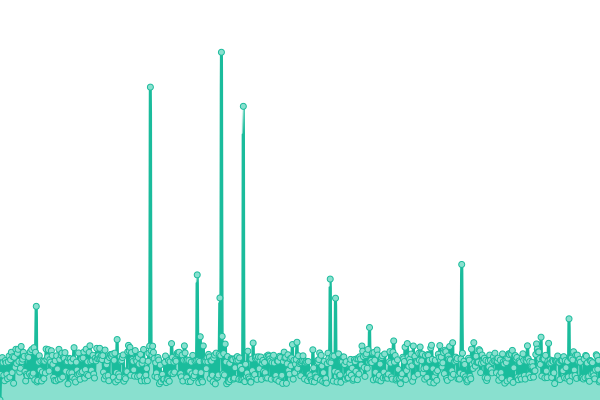
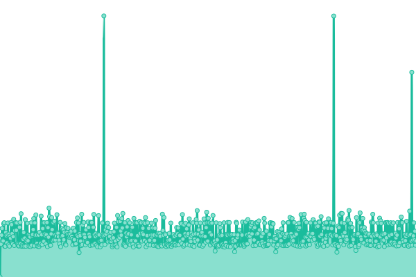
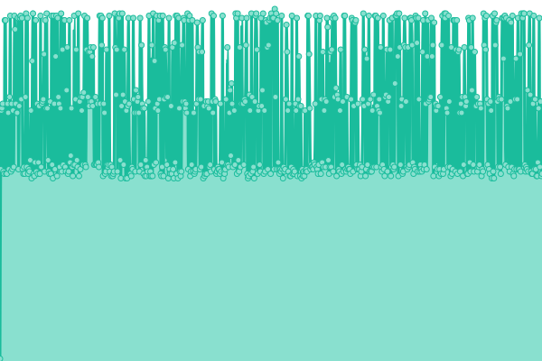
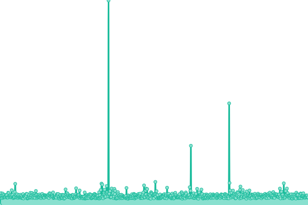

# [📈 Live Status](https://dev-okticket.github.io/status): <!--live status--> **🟩 All systems operational**

This repository contains the open-source uptime monitor and status page for [dev-okticket](https://dev-okticket.github.io/status), powered by [Upptime](https://github.com/upptime/upptime).

With [Upptime](https://upptime.js.org), you can get your own unlimited and free uptime monitor and status page, powered entirely by a GitHub repository. We use [Issues](https://github.com/dev-okticket/status/issues) as incident reports, [Actions](https://github.com/dev-okticket/status/actions) as uptime monitors, and [Pages](https://dev-okticket.github.io/status) for the status page.

<!--start: status pages-->
<!-- This summary is generated by Upptime (https://github.com/upptime/upptime) -->
<!-- Do not edit this manually, your changes will be overwritten -->
<!-- prettier-ignore -->
| URL | Status | History | Response Time | Uptime |
| --- | ------ | ------- | ------------- | ------ |
|  [OKTicket](https://www.okticket.es) | 🟩 Up | [ok-ticket.yml](https://github.com/dev-okticket/status/commits/HEAD/history/ok-ticket.yml) | 

 1905ms
     
 | 

<a href="https://dev-okticket.github.io/status/history/ok-ticket">100.00%</a>
    

|  [Gestor OKTicket](https://admin.okticket.es/) | 🟩 Up | [gestor-ok-ticket.yml](https://github.com/dev-okticket/status/commits/HEAD/history/gestor-ok-ticket.yml) | 

 767ms
     
 | 

<a href="https://dev-okticket.github.io/status/history/gestor-ok-ticket">100.00%</a>
    

|  [Gestor Nuevo](https://adminokt.okticket.es/) | 🟩 Up | [gestor-nuevo.yml](https://github.com/dev-okticket/status/commits/HEAD/history/gestor-nuevo.yml) | 

 1060ms
     
 | 

<a href="https://dev-okticket.github.io/status/history/gestor-nuevo">100.00%</a>
    

|  [BBDD Mongo](https://api.okticket.es/v2/public/api/monitor/mongodb) | 🟩 Up | [bbdd-mongo.yml](https://github.com/dev-okticket/status/commits/HEAD/history/bbdd-mongo.yml) | 

 938ms
     
 | 

<a href="https://dev-okticket.github.io/status/history/bbdd-mongo">0.00%</a>
    

|  [BBDD Mysql](https://api.okticket.es/v2/public/api/monitor/mysql) | 🟩 Up | [bbdd-mysql.yml](https://github.com/dev-okticket/status/commits/HEAD/history/bbdd-mysql.yml) | 

 266ms
     
 | 

<a href="https://dev-okticket.github.io/status/history/bbdd-mysql">0.00%</a>
    

<!--end: status pages-->

[**Visit our status website →**](https://dev-okticket.github.io/status)

## 📄 License

- Powered by: [Upptime](https://github.com/upptime/upptime)
- Code: [MIT](./LICENSE) © [dev-okticket](https://dev-okticket.github.io/status)
- Data in the `./history` directory: [Open Database License](https://opendatacommons.org/licenses/odbl/1-0/)
